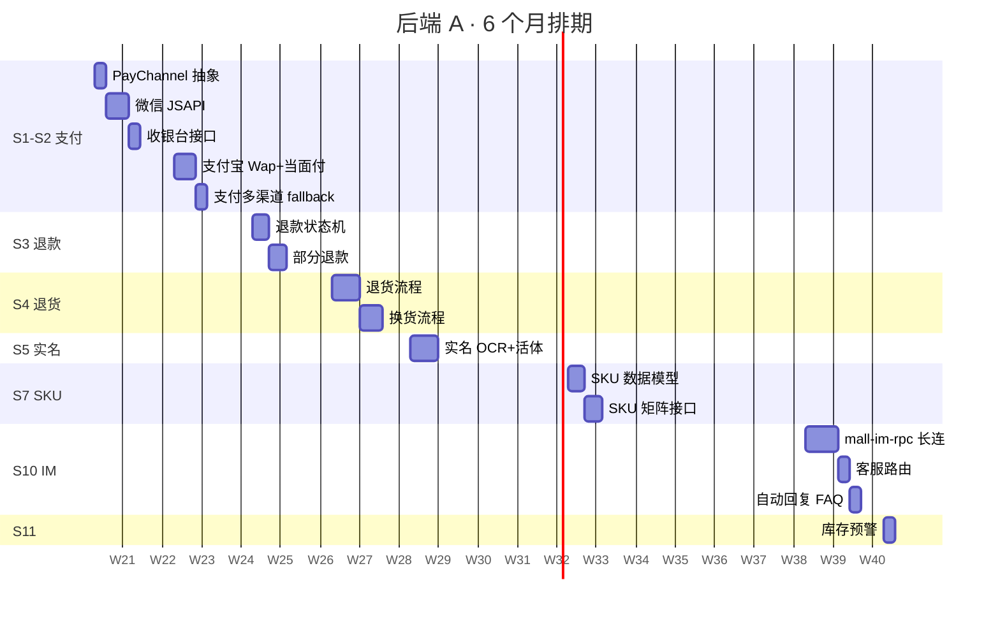
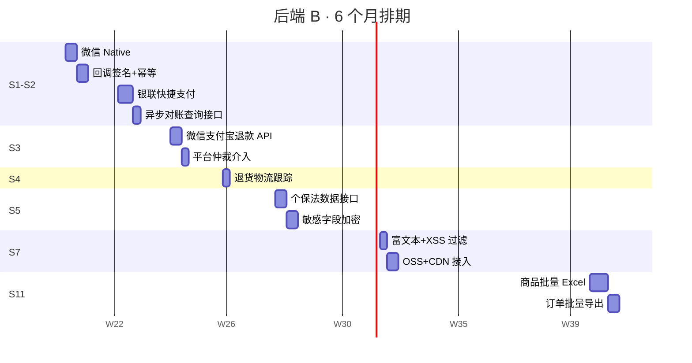
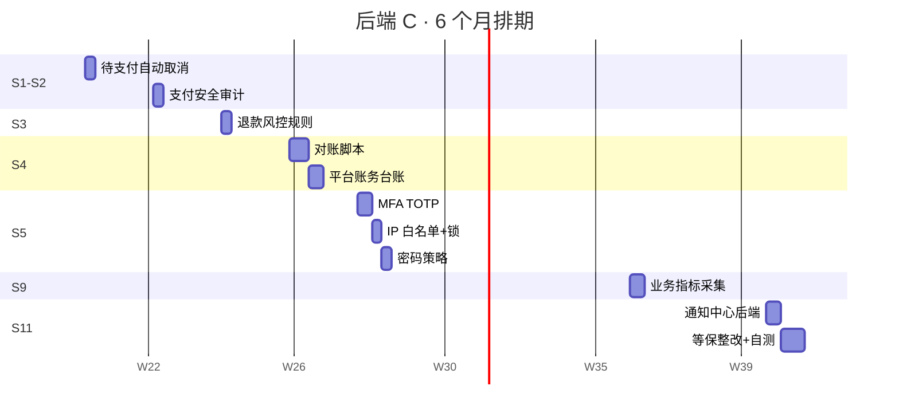
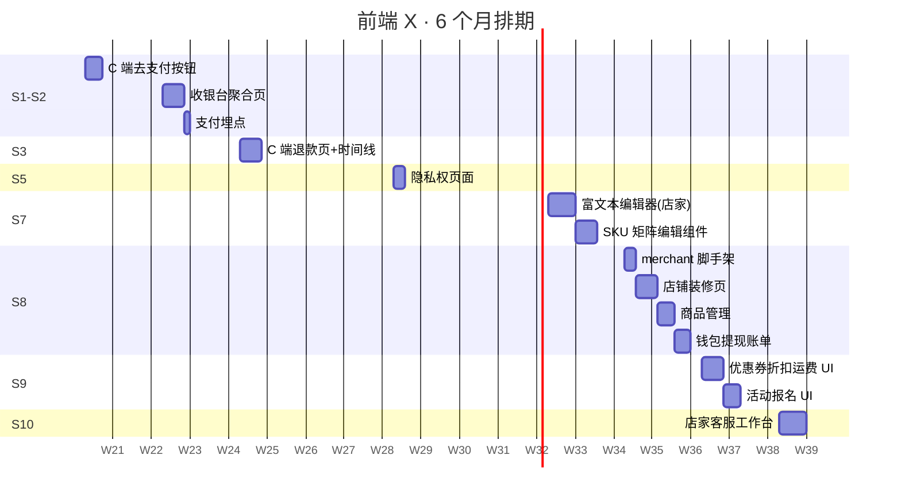
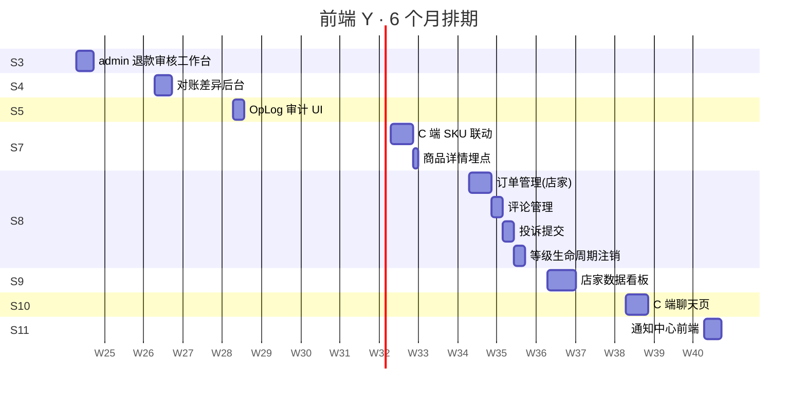
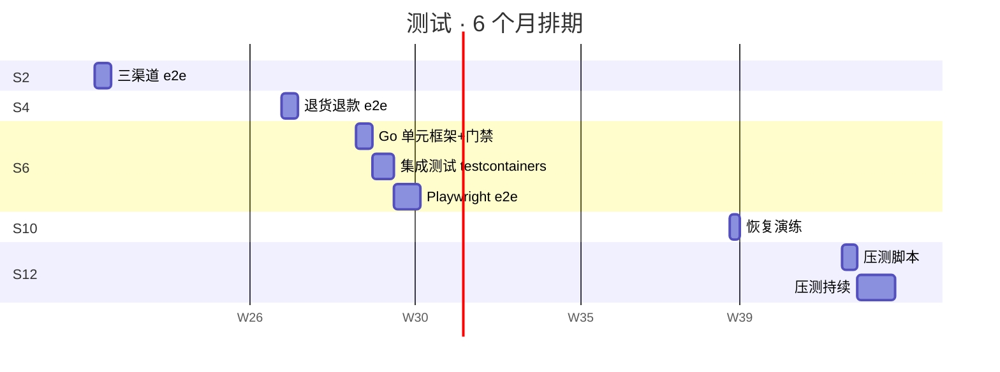
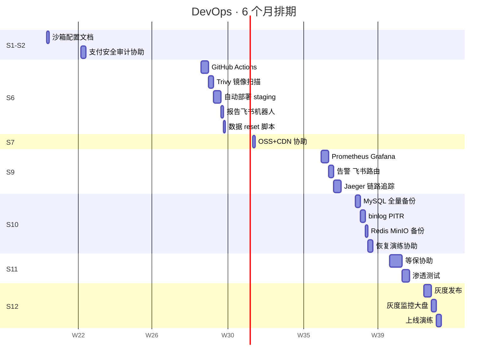

# MVP Q1/Q2 任务追踪 & 角色甘特图

**编写日期：** 2026-05-12
**对应阶段：** MVP（W1-W24，6 个月 = 2 个季度）
**关联文档：** [`mvp_sprint_plan.md`](mvp_sprint_plan.md)

---

## 0. 状态图例

| 状态 | 含义 |
|---|---|
| ⬜ | 未开始 |
| 🟦 | 进行中 |
| ✅ | 已完成 |
| ⚠️ | 进度风险 |
| 🚫 | 阻塞 |

> 每周一上午同步状态。

---

## 1. Sprint 级追踪表

| Sprint | 周期 | 目标 | 进度 | 负责模块 | 验收 | 备注 |
|---|---|---|---|---|---|---|
| **S0** | W0 | 启动周（环境/工具/培训） | ⬜ | 全员 | DoD 已发布、Sprint Board 就绪 | 不算正式 Sprint |
| **S1** | W1-2 | 微信支付 JSAPI + Native | ⬜ | 后端 A/B/C · 前端 X · DevOps | 真实账号完成 1 分钱支付 | 资质提前申请 |
| **S2** | W3-4 | 支付宝 + 银联 + 收银台 UI | ⬜ | 后端 A/B/C · 前端 X · 测试 | 三渠道 e2e 通过率 ≥ 95% | — |
| **S3** | W5-6 | 退款 + 订单状态机 | ⬜ | 后端 A/B/C · 前端 X/Y | 资金一致性核对通过 | — |
| **S4** | W7-8 | 退货换货 + 财务对账 | ⬜ | 后端 A/B/C · 前端 Y · 测试 | 3 天对账无差异 | 银行账单格式确认 |
| **S5** | W9-10 | 安全 / 实名 / 合规 | ⬜ | 后端 A/B/C · 前端 X/Y | 外部安全清单 100% | 腾讯云 IDV 接入 |
| **S6** | W11-12 | CI/CD + 自动化测试 | ⬜ | DevOps · 测试 | PR pipeline < 15min | — |
| **S7** | W13-14 | SKU 多规格 + 富文本 | ⬜ | 后端 A/B · 前端 X/Y · DevOps | T 恤 6 SKU demo | OSS 配额申请 |
| **S8** | W15-16 | 店家 SPA 第一批 | ⬜ | 前端 X/Y | 店家闭环（上架→收款→提现） | — |
| **S9** | W17-18 | 店家 SPA 第二批 + 监控 | ⬜ | 前端 X/Y · 后端 C · DevOps | 5 故障场景 5 分钟告警 | — |
| **S10** | W19-20 | 客服 IM + 备份灾备 | ⬜ | 后端 A · 前端 X/Y · DevOps · 测试 | 主库被删 30min 恢复 | IM 范围最小化 |
| **S11** | W21-22 | 库存/批量/等保 | ⬜ | 后端 A/B/C · 前端 X/Y · DevOps | 等保自测 80+ 项无高危 | 外部测评机构联系 |
| **S12** | W23-24 | 压测 + 灰度上线 GA | ⬜ | 全员 | 灰度 1 周指标无负向 | 50 家试运营开通 |

---

## 2. Q1 任务追踪表（W1-W12，S1-S6）

> **Q1 主题：交易闭环 + 合规 + 工程基建** —— Q1 末必须达到「支付/退款/合规」底线。

### S1 微信支付

| ID | Story | 负责 | 工时(d) | 状态 | 阻塞 |
|---|---|---|---|---|---|
| S1.1 | PayChannel 接口抽象 | 后端 A | 2 | ⬜ | — |
| S1.2 | 微信 JSAPI 接入 | 后端 A | 4 | ⬜ | 商户号 |
| S1.3 | 微信 Native 接入 | 后端 B | 3 | ⬜ | 商户号 |
| S1.4 | 回调幂等 + 签名校验 | 后端 B | 3 | ⬜ | — |
| S1.5 | 收银台接口 | 后端 A | 2 | ⬜ | S1.1 |
| S1.6 | C 端去支付按钮 → 微信 | 前端 X | 3 | ⬜ | S1.5 |
| S1.7 | 待支付自动取消（15min） | 后端 C | 2 | ⬜ | — |
| S1.8 | 沙箱配置文档 | DevOps | 1 | ⬜ | — |

### S2 支付宝/银联 + 收银台

| ID | Story | 负责 | 工时(d) | 状态 | 阻塞 |
|---|---|---|---|---|---|
| S2.1 | 支付宝 Wap + 当面付 | 后端 A | 4 | ⬜ | — |
| S2.2 | 银联快捷支付 | 后端 B | 4 | ⬜ | 商户号 |
| S2.3 | 收银台聚合页 UI | 前端 X | 4 | ⬜ | S1.5 |
| S2.4 | 多渠道 fallback | 后端 A | 2 | ⬜ | S2.1/S2.2 |
| S2.5 | 异步对账查询接口 | 后端 B | 2 | ⬜ | S1.4 |
| S2.6 | 支付埋点 | 前端 X | 1 | ⬜ | S2.3 |
| S2.7 | 三渠道 e2e 测试 | 测试 | 3 | ⬜ | S2.1/S2.2/S2.3 |
| S2.8 | 支付安全审计 | 后端 C / DevOps | 2 | ⬜ | S1.4 |

### S3 退款 + 状态机

| ID | Story | 负责 | 工时(d) | 状态 | 阻塞 |
|---|---|---|---|---|---|
| S3.1 | 退款状态机 | 后端 A | 3 | ⬜ | — |
| S3.2 | 部分退款（按 SKU/金额） | 后端 A | 3 | ⬜ | S3.1 |
| S3.3 | 微信/支付宝退款 API | 后端 B | 3 | ⬜ | S1.4 |
| S3.4 | 平台仲裁介入 | 后端 B | 2 | ⬜ | S3.1 |
| S3.5 | C 端退款页 + 时间线 | 前端 X | 4 | ⬜ | S3.1 |
| S3.6 | admin 退款审核工作台 | 前端 Y | 3 | ⬜ | S3.4 |
| S3.7 | 退款风控规则 | 后端 C | 2 | ⬜ | — |

### S4 退货换货 + 对账

| ID | Story | 负责 | 工时(d) | 状态 | 阻塞 |
|---|---|---|---|---|---|
| S4.1 | 退货流程 | 后端 A | 5 | ⬜ | S3.3 |
| S4.2 | 换货流程 | 后端 A | 4 | ⬜ | S3.3 |
| S4.3 | 退货物流跟踪 | 后端 B | 2 | ⬜ | — |
| S4.4 | 对账脚本（每日下载比对） | 后端 C | 4 | ⬜ | S2.5 |
| S4.5 | 平台账务台账 | 后端 C | 3 | ⬜ | — |
| S4.6 | 对账差异处理后台 | 前端 Y | 3 | ⬜ | S4.4 |
| S4.7 | 退货退款 e2e | 测试 | 3 | ⬜ | S4.1/S4.2 |

### S5 安全 + 实名 + 合规

| ID | Story | 负责 | 工时(d) | 状态 | 阻塞 |
|---|---|---|---|---|---|
| S5.1 | admin MFA（TOTP + 短信） | 后端 C | 3 | ⬜ | — |
| S5.2 | IP 白名单 + 失败锁 | 后端 C | 2 | ⬜ | — |
| S5.3 | 密码策略 | 后端 C | 2 | ⬜ | — |
| S5.4 | 实名认证（OCR + 活体） | 后端 A | 5 | ⬜ | 腾讯云资质 |
| S5.5 | 个保法数据接口 | 后端 B | 3 | ⬜ | — |
| S5.6 | 敏感字段加密存储 | 后端 B | 3 | ⬜ | — |
| S5.7 | 隐私权页面 | 前端 X | 2 | ⬜ | — |
| S5.8 | OpLog 审计查询 UI | 前端 Y | 2 | ⬜ | — |

### S6 CI/CD + 测试基建

| ID | Story | 负责 | 工时(d) | 状态 | 阻塞 |
|---|---|---|---|---|---|
| S6.1 | GitHub Actions（build/test/lint） | DevOps | 3 | ⬜ | — |
| S6.2 | Trivy 镜像安全扫描 | DevOps | 2 | ⬜ | S6.1 |
| S6.3 | 自动部署 staging | DevOps | 3 | ⬜ | S6.1 |
| S6.4 | Go 单元测试框架 + 覆盖率门禁 | 测试 | 3 | ⬜ | S6.1 |
| S6.5 | testcontainers 集成测试 | 测试 | 4 | ⬜ | S6.4 |
| S6.6 | Playwright e2e | 测试 | 5 | ⬜ | S6.3 |
| S6.7 | 测试报告 + 飞书机器人 | DevOps | 1 | ⬜ | S6.4 |
| S6.8 | staging 数据 reset 脚本 | DevOps | 1 | ⬜ | S6.3 |

---

## 3. Q2 任务追踪表（W13-W24，S7-S12）

> **Q2 主题：用户体验完整 + 店家自助 + 上线 GA**

### S7 SKU + 富文本

| ID | Story | 负责 | 工时(d) | 状态 | 阻塞 |
|---|---|---|---|---|---|
| S7.1 | 多规格 SKU 数据模型 | 后端 A | 3 | ⬜ | — |
| S7.2 | SKU 矩阵接口 | 后端 A | 3 | ⬜ | S7.1 |
| S7.3 | 富文本 HTML + XSS 过滤 | 后端 B | 2 | ⬜ | — |
| S7.4 | OSS + CDN 接入 | 后端 B / DevOps | 3 | ⬜ | 阿里云开通 |
| S7.5 | 店家富文本编辑器（前端） | 前端 X | 5 | ⬜ | S7.3 |
| S7.6 | SKU 矩阵编辑组件 | 前端 X | 4 | ⬜ | S7.2 |
| S7.7 | C 端 SKU 联动选择 | 前端 Y | 4 | ⬜ | S7.2 |
| S7.8 | 商品详情埋点 | 前端 Y | 1 | ⬜ | — |

### S8 店家 SPA 第一批

| ID | Story | 负责 | 工时(d) | 状态 | 阻塞 |
|---|---|---|---|---|---|
| S8.1 | merchant 脚手架 | 前端 X | 2 | ⬜ | — |
| S8.2 | 店铺信息 + 装修页 | 前端 X | 4 | ⬜ | S8.1 |
| S8.3 | 商品管理（含 S7 组件） | 前端 X | 3 | ⬜ | S7.5/S7.6 |
| S8.4 | 订单管理 + 批量发货 | 前端 Y | 4 | ⬜ | S8.1 |
| S8.5 | 评论管理 | 前端 Y | 2 | ⬜ | S8.1 |
| S8.6 | 投诉提交 + 列表 | 前端 Y | 2 | ⬜ | S8.1 |
| S8.7 | 钱包 + 提现 + 账单 | 前端 X | 3 | ⬜ | S8.1 |
| S8.8 | 等级/生命周期/注销 | 前端 Y | 2 | ⬜ | S8.1 |

### S9 店家 SPA 第二批 + 监控

| ID | Story | 负责 | 工时(d) | 状态 | 阻塞 |
|---|---|---|---|---|---|
| S9.1 | 优惠券/折扣/运费模板 | 前端 X | 4 | ⬜ | S8.1 |
| S9.2 | 店家数据看板 | 前端 Y | 5 | ⬜ | S8.1 |
| S9.3 | 营销活动报名 | 前端 X | 3 | ⬜ | S8.1 |
| S9.4 | Prometheus + Grafana | DevOps | 3 | ⬜ | — |
| S9.5 | 业务指标采集 | 后端 C / DevOps | 3 | ⬜ | S9.4 |
| S9.6 | 告警 + 飞书路由 | DevOps | 2 | ⬜ | S9.5 |
| S9.7 | Jaeger 链路追踪 | DevOps | 3 | ⬜ | — |

### S10 客服 IM + 备份

| ID | Story | 负责 | 工时(d) | 状态 | 阻塞 |
|---|---|---|---|---|---|
| S10.1 | mall-im-rpc 长连 + 会话 | 后端 A | 6 | ⬜ | — |
| S10.2 | 客服路由 | 后端 A | 2 | ⬜ | S10.1 |
| S10.3 | C 端聊天页 | 前端 Y | 4 | ⬜ | S10.1 |
| S10.4 | 店家客服工作台 | 前端 X | 5 | ⬜ | S10.1 |
| S10.5 | 自动回复 + FAQ | 后端 A | 2 | ⬜ | S10.1 |
| S10.6 | MySQL 全量备份 | DevOps | 2 | ⬜ | — |
| S10.7 | binlog + PITR | DevOps | 2 | ⬜ | S10.6 |
| S10.8 | Redis/MinIO 备份 | DevOps | 1 | ⬜ | — |
| S10.9 | 恢复演练 | DevOps / 测试 | 2 | ⬜ | S10.6 |

### S11 库存/批量/等保

| ID | Story | 负责 | 工时(d) | 状态 | 阻塞 |
|---|---|---|---|---|---|
| S11.1 | 库存预警 + 自动下架 | 后端 A | 2 | ⬜ | — |
| S11.2 | 商品批量 Excel | 后端 B / 前端 X | 5 | ⬜ | S7.1 |
| S11.3 | 订单批量导出 | 后端 B | 3 | ⬜ | — |
| S11.4 | 通知中心（站内信/邮件/短信） | 后端 C / 前端 Y | 5 | ⬜ | — |
| S11.5 | 等保自测 + 整改 | DevOps / 后端 C | 5 | ⬜ | S5 |
| S11.6 | 渗透测试 | DevOps / 全员 | 3 | ⬜ | S11.5 |
| S11.7 | ICP 备案 | PM | — | ⬜ | 外部 |

### S12 压测 + 灰度上线

| ID | Story | 负责 | 工时(d) | 状态 | 阻塞 |
|---|---|---|---|---|---|
| S12.1 | 压测脚本 | 测试 / DevOps | 3 | ⬜ | S9.4 |
| S12.2 | 压测目标达成 | 测试 / DevOps | 持续 | ⬜ | S12.3 |
| S12.3 | 性能优化 | 后端 全员 | 4 | ⬜ | S12.1 |
| S12.4 | 慢查询分析 + 优化 | DevOps | 2 | ⬜ | S9.4 |
| S12.5 | 灰度发布 | DevOps | 3 | ⬜ | — |
| S12.6 | 灰度监控大盘 | DevOps | 2 | ⬜ | S9.4 |
| S12.7 | 上线演练 + 回滚 | 全员 | 2 | ⬜ | S12.5 |
| S12.8 | 应急预案 + 值班表 | PM / DevOps | 1 | ⬜ | — |
| S12.9 | GA 公告 + 50 家开通 | PM / 运营 | 2 | ⬜ | S12.7 |

---

## 4. 角色甘特图

> 用 Mermaid `gantt` 语法，GitHub 自动渲染。
> 时间轴以**周**为单位（W1 = 开发第 1 周，对应 Sprint 1 起点）。

### 4.1 后端 A（支付 / 退款 / 退货 / SKU / IM 核心）

### 4.2 后端 B（支付通道 / 退款 API / 物流 / 安全 / 富文本 / 批量）

### 4.3 后端 C（自动化 / 风控 / 财务对账 / 安全 / 通知 / 等保）

### 4.4 前端 X（C 端 + merchant SPA 主战）

### 4.5 前端 Y（admin 工作台 + C 端深度 + 看板 / IM）

### 4.6 测试（自动化测试 + 压测）

### 4.7 DevOps（CI/CD + 监控 + 备份 + 上线）

---

## 5. 角色负载汇总（人天）

| 角色 | Q1 (S1-S6) | Q2 (S7-S12) | 总计 | 平均利用率 |
|---|---|---|---|---|
| 后端 A | 16 + 9 = 25 | 6 + 8 + 10 + 2 = 26 | 51 | 85% |
| 后端 B | 17 + 12 + 6 = 35（含 S2.5/S5.5/S5.6） | 5 + 8 = 13 | 48 | 80% |
| 后端 C | 8 + 7 + 2 = 17 | 0 + 3 + 8 = 11 | 28 | 47%（buffer） |
| 前端 X | 3 + 5 + 2 + 4 = 14 | 9 + 12 + 7 + 5 = 33 | 47 | 78% |
| 前端 Y | 0 + 3 + 3 + 2 = 8 | 5 + 10 + 5 + 4 + 3 = 27 | 35 | 58%（含 buffer） |
| 测试 | 3 + 3 + 12 = 18 | 2 + 10 = 12 | 30 | 50%（含 buffer） |
| DevOps | 1 + 2 + 10 = 13 | 1 + 8 + 7 + 8 + 7 = 31 | 44 | 73% |

> 实际负载估算 60-90% 区间为健康；后端 C / 前端 Y / 测试 有较多 buffer 应对临时支援/bug fix/串讲。

---

## 6. 关键里程碑日历

| 周 | 日期（参考） | 里程碑 |
|---|---|---|
| W2 末 | 2026-05-30 | 🎯 微信支付 e2e |
| W4 末 | 2026-06-13 | 🎯 三渠道支付 + 收银台 |
| W6 末 | 2026-06-27 | 🎯 退款闭环（资金一致） |
| W8 末 | 2026-07-11 | 🎯 退货换货 + 对账自动化 |
| W10 末 | 2026-07-25 | 🎯 合规底线（MFA/实名/个保法） |
| W12 末 | 2026-08-08 | 🎯 CI/CD + 测试自动化基建 |
| W16 末 | 2026-09-05 | 🎯 店家 SPA 全闭环可用 |
| W18 末 | 2026-09-19 | 🎯 监控 + 链路追踪 |
| W20 末 | 2026-10-03 | 🎯 IM + 备份灾备 |
| W22 末 | 2026-10-17 | 🎯 等保提交 |
| W24 末 | 2026-10-31 | 🚀 灰度上线 GA |

---

## 7. 风险监控点

| 风险 | 监控指标 | 触发动作 |
|---|---|---|
| 微信/支付宝资质未到 | W2 末未拿到商户号 | S1.2/S1.3 紧急 fallback 沙箱演示，资质组每日同步 |
| 单 Sprint Velocity 跌 20% | 完成 Story 数 / 计划 | 复盘会立项 + 砍 P2 Story |
| 缺陷逃逸率 > 5% | 生产 bug 计数 | S6 测试覆盖回炉 |
| 后端 C 利用率 < 30% | 周报负载 | 调度去做技术债 / 文档 / 跨组支援 |
| 等保整改超过 5d | S11 进度 | 提前邀外部咨询机构 |

---

## 8. 更新流程

1. **每周一上午**：所有 Story owner 在 `## 2/3` 表格里更新自己 Story 的状态列
2. **每周五下午**：PM 把状态截图发到周报；归档到 `daily/YYYY-MM-DD.md`
3. **甘特图**：原则上不动，除非 sprint 重大 reslot，需在文档头部加 `## 变更记录` 区块
