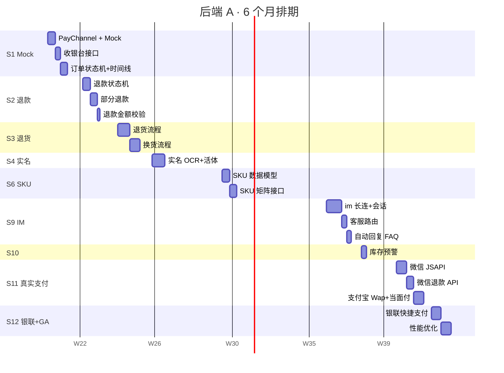
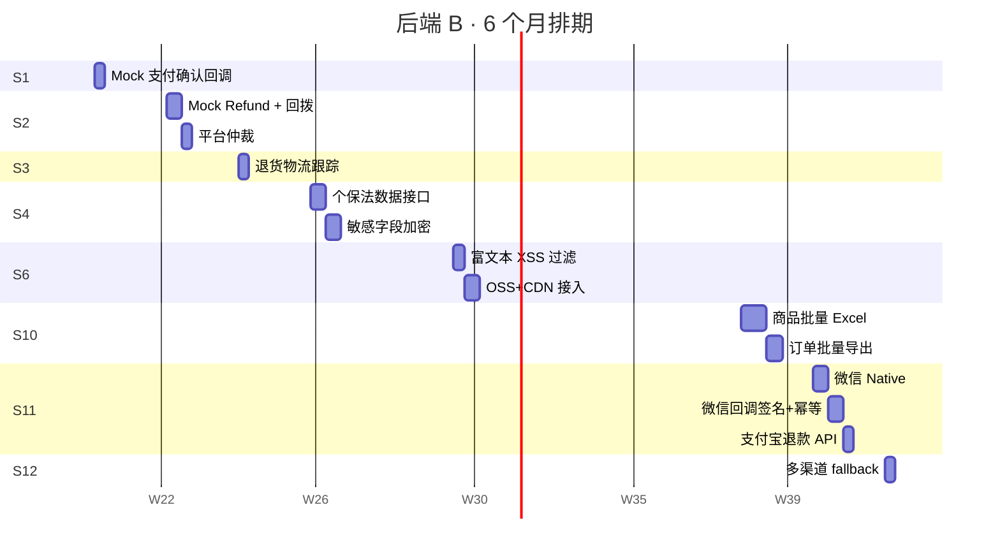
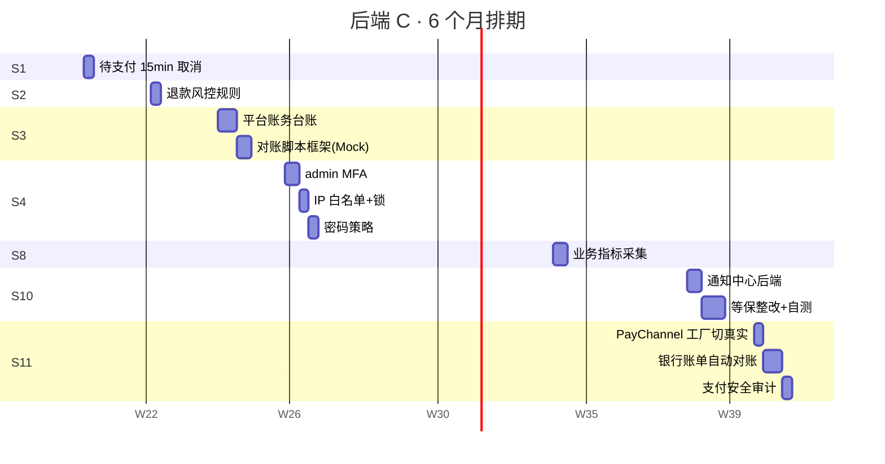
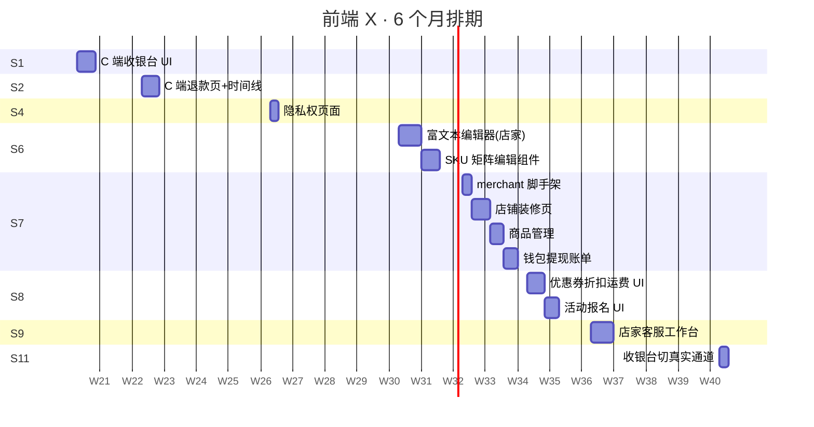
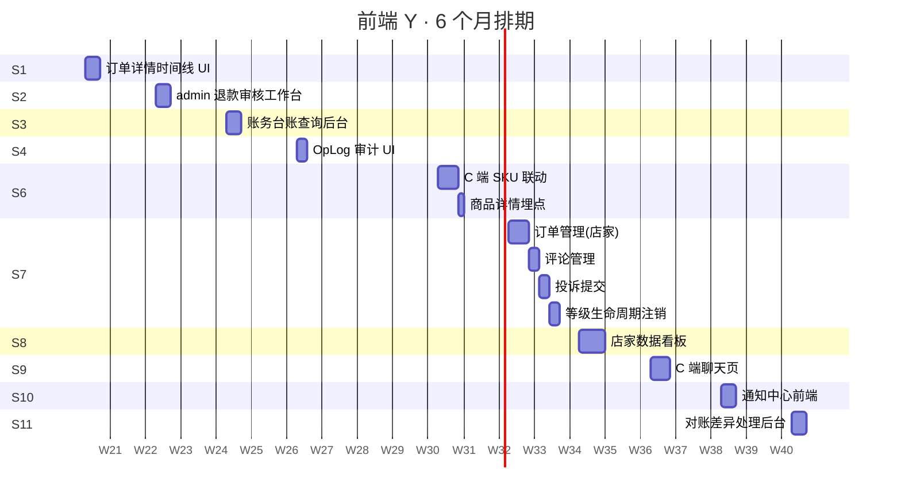
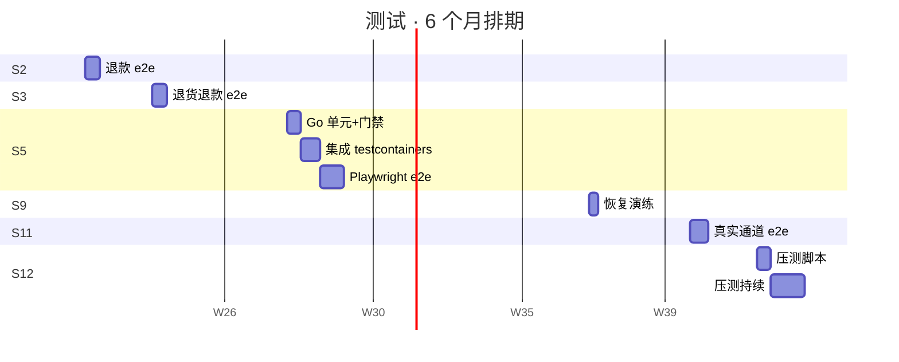
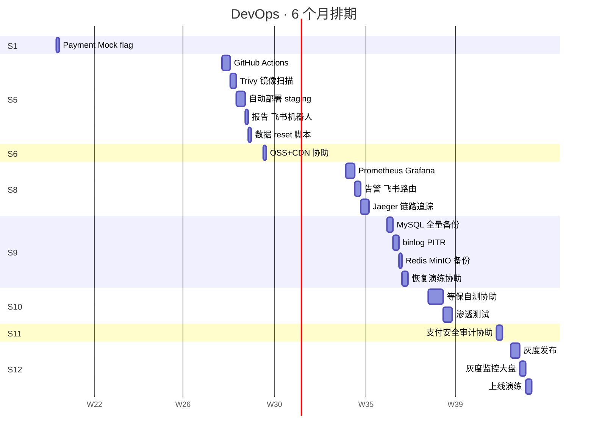

# MVP Q1/Q2 任务追踪 & 角色甘特图

**编写日期：** 2026-05-12
**修订：** 2026-05-12 v1.1 — 真实支付通道延后到 S11-S12，前期用 Mock 走通业务闭环
**对应阶段：** MVP（W1-W24，6 个月 = 2 个季度）
**关联文档：** [`mvp_sprint_plan.md`](mvp_sprint_plan.md)

---

## 0. 状态图例

| 状态 | 含义 |
|---|---|
| ⬜ | 未开始 |
| 🟦 | 进行中 |
| ✅ | 已完成 |
| ⚠️ | 进度风险 |
| 🚫 | 阻塞 |

> 每周一上午同步状态。

---

## 1. Sprint 级追踪表

| Sprint | 周期 | 目标 | 进度 | 负责模块 | 备注 |
|---|---|---|---|---|---|
| **S0** | W0 | 启动周（环境/工具/培训 + 商户号申请） | ⬜ | 全员 + PM | 商户号申请必须 S0 启动，等待外部 2-4 周 |
| **S1** | W1-2 | PayChannel 抽象 + **Mock 通道** + 收银台 UI | ✅ | 后端 A/B/C · 前端 X/Y · DevOps | Mock 让全链路下单可走通；提前 9 天交付（单人 + agent） |
| **S2** | W3-4 | 退款流程（Mock）+ 订单状态机 | ✅ | 后端 A/B/C · 前端 X/Y · 测试 | 退款资金回拨基于 Mock 演练 |
| **S3** | W5-6 | 退货换货 + 财务台账（Mock 流水） | ⬜ | 后端 A/B/C · 前端 Y · 测试 | 台账逻辑提前 8 周演练 |
| **S4** | W7-8 | 安全 / 实名 / 合规 | ⬜ | 后端 A/B/C · 前端 X/Y | 腾讯云 IDV 接入 |
| **S5** | W9-10 | CI/CD + 自动化测试 | ⬜ | DevOps · 测试 | PR pipeline < 15 min |
| **S6** | W11-12 | SKU 多规格 + 富文本 | ⬜ | 后端 A/B · 前端 X/Y · DevOps | OSS 配额申请 |
| **S7** | W13-14 | 店家 SPA 第一批 | ⬜ | 前端 X/Y | 店家闭环 |
| **S8** | W15-16 | 店家 SPA 第二批 + 监控告警 | ⬜ | 前端 X/Y · 后端 C · DevOps | 5 故障场景 5 min 告警 |
| **S9** | W17-18 | 客服 IM + 备份灾备 | ⬜ | 后端 A · 前端 X/Y · DevOps · 测试 | 30 min 灾备恢复 |
| **S10** | W19-20 | 库存预警 + 批量 + 等保 + 渗透 | ⬜ | 后端 A/B/C · 前端 X/Y · DevOps | 等保自测 80+ 项 |
| **S11** | W21-22 | **微信 + 支付宝 真实通道** + 银行对账 | ⬜ | 后端 A/B/C · 前端 X/Y · 测试 | 商户号资质必须 W20 末到账 |
| **S12** | W23-24 | 银联 + 压测 + 灰度 + GA | ⬜ | 全员 | 50 家试运营开通 |

---

## 2. Q1 任务追踪表（W1-W12，S1-S6）

> **Q1 主题：业务闭环（Mock）+ 合规 + 工程基建** —— Q1 末除真实支付通道外其它都已就位。

### S1 PayChannel + Mock + 收银台

| ID | Story | 负责 | 工时(d) | 状态 | 阻塞 |
|---|---|---|---|---|---|
| S1.1 | PayChannel 接口 + MockChannel | 后端 A | 3 | ✅ | — |
| S1.2 | 收银台接口 `/cashier/:order_id` | 后端 A | 2 | ✅ | S1.1 |
| S1.3 | Mock 支付确认回调 | 后端 B | 2 | ✅ | S1.1 |
| S1.4 | 待支付 15min 自动取消 | 后端 C | 2 | ✅ | — |
| S1.5 | 订单状态机 + 时间线 | 后端 A | 3 | ✅ | — |
| S1.6 | C 端收银台 UI（Mock 模式按钮） | 前端 X | 4 | ✅ | S1.2 |
| S1.7 | 订单详情时间线 UI | 前端 Y | 3 | ✅ | S1.5 |
| S1.8 | PAYMENT_MOCK_ENABLED feature flag | DevOps | 1 | ✅ | — |

### S2 退款（Mock）+ 状态机

| ID | Story | 负责 | 工时(d) | 状态 | 阻塞 |
|---|---|---|---|---|---|
| S2.1 | 退款状态机 | 后端 A | 3 | ✅ | S1.5 |
| S2.2 | 部分退款（按 SKU/金额） | 后端 A | 3 | ✅ | S2.1 |
| S2.3 | MockChannel.Refund + 资金回拨 | 后端 B | 3 | ✅ | S1.1 |
| S2.4 | 平台仲裁介入 | 后端 B | 2 | ✅ | S2.1 |
| S2.5 | 退款金额校验 | 后端 A | 1 | ✅ | S2.1 |
| S2.6 | C 端退款页 + 时间线 | 前端 X | 4 | ✅ | S2.1 |
| S2.7 | admin 退款审核工作台 | 前端 Y | 3 | ✅ | S2.4 |
| S2.8 | 退款风控规则 | 后端 C | 2 | ✅ | — |
| S2.9 | 退款 e2e | 测试 | 3 | ✅ | S2.1/S2.3 |

### S3 退货换货 + 财务台账（Mock）

| ID | Story | 负责 | 工时(d) | 状态 | 阻塞 |
|---|---|---|---|---|---|
| S3.1 | 退货流程 | 后端 A | 5 | ⬜ | S2.3 |
| S3.2 | 换货流程 | 后端 A | 4 | ⬜ | S2.3 |
| S3.3 | 退货物流跟踪 | 后端 B | 2 | ⬜ | — |
| S3.4 | 平台账务台账 | 后端 C | 4 | ⬜ | — |
| S3.5 | 对账核对脚本框架（Mock） | 后端 C | 3 | ⬜ | S3.4 |
| S3.6 | 账务台账查询后台 | 前端 Y | 3 | ⬜ | S3.4 |
| S3.7 | 退货退款 e2e | 测试 | 3 | ⬜ | S3.1/S3.2 |

### S4 安全 / 实名 / 合规

| ID | Story | 负责 | 工时(d) | 状态 | 阻塞 |
|---|---|---|---|---|---|
| S4.1 | admin MFA（TOTP + 短信） | 后端 C | 3 | ⬜ | — |
| S4.2 | IP 白名单 + 失败锁 | 后端 C | 2 | ⬜ | — |
| S4.3 | 密码策略 | 后端 C | 2 | ⬜ | — |
| S4.4 | 实名 OCR + 活体 | 后端 A | 5 | ⬜ | 腾讯云资质 |
| S4.5 | 个保法数据接口 | 后端 B | 3 | ⬜ | — |
| S4.6 | 敏感字段加密存储 | 后端 B | 3 | ⬜ | — |
| S4.7 | 隐私权 + 用户协议 | 前端 X | 2 | ⬜ | — |
| S4.8 | OpLog 审计 UI | 前端 Y | 2 | ⬜ | — |

### S5 CI/CD + 自动化测试

| ID | Story | 负责 | 工时(d) | 状态 | 阻塞 |
|---|---|---|---|---|---|
| S5.1 | GitHub Actions build/test/lint | DevOps | 3 | ⬜ | — |
| S5.2 | Trivy 镜像扫描 | DevOps | 2 | ⬜ | S5.1 |
| S5.3 | 自动部署 staging | DevOps | 3 | ⬜ | S5.1 |
| S5.4 | Go 单元 + 覆盖率门禁 | 测试 | 3 | ⬜ | S5.1 |
| S5.5 | testcontainers 集成 | 测试 | 4 | ⬜ | S5.4 |
| S5.6 | Playwright e2e | 测试 | 5 | ⬜ | S5.3 |
| S5.7 | 报告 + 飞书机器人 | DevOps | 1 | ⬜ | S5.4 |
| S5.8 | staging 数据 reset | DevOps | 1 | ⬜ | S5.3 |

### S6 SKU + 富文本

| ID | Story | 负责 | 工时(d) | 状态 | 阻塞 |
|---|---|---|---|---|---|
| S6.1 | 多规格 SKU 数据模型 | 后端 A | 3 | ⬜ | — |
| S6.2 | SKU 矩阵接口 | 后端 A | 3 | ⬜ | S6.1 |
| S6.3 | 富文本 + XSS 过滤 | 后端 B | 2 | ⬜ | — |
| S6.4 | OSS + CDN 接入 | 后端 B / DevOps | 3 | ⬜ | 阿里云开通 |
| S6.5 | 富文本编辑器（店家） | 前端 X | 5 | ⬜ | S6.3 |
| S6.6 | SKU 矩阵编辑组件 | 前端 X | 4 | ⬜ | S6.2 |
| S6.7 | C 端 SKU 联动 | 前端 Y | 4 | ⬜ | S6.2 |
| S6.8 | 商品详情埋点 | 前端 Y | 1 | ⬜ | — |

---

## 3. Q2 任务追踪表（W13-W24，S7-S12）

> **Q2 主题：店家自助 + IM + 等保 + 真实支付 + GA**

### S7 店家 SPA 第一批

| ID | Story | 负责 | 工时(d) | 状态 | 阻塞 |
|---|---|---|---|---|---|
| S7.1 | merchant 脚手架 | 前端 X | 2 | ⬜ | — |
| S7.2 | 店铺信息 + 装修 | 前端 X | 4 | ⬜ | S7.1 |
| S7.3 | 商品管理（含 S6 组件） | 前端 X | 3 | ⬜ | S6.5/S6.6 |
| S7.4 | 订单管理 + 批量发货 | 前端 Y | 4 | ⬜ | S7.1 |
| S7.5 | 评论管理 | 前端 Y | 2 | ⬜ | S7.1 |
| S7.6 | 投诉提交 + 列表 | 前端 Y | 2 | ⬜ | S7.1 |
| S7.7 | 钱包/提现/账单 | 前端 X | 3 | ⬜ | S7.1 |
| S7.8 | 等级/生命周期/注销 | 前端 Y | 2 | ⬜ | S7.1 |

### S8 店家 SPA 第二批 + 监控

| ID | Story | 负责 | 工时(d) | 状态 | 阻塞 |
|---|---|---|---|---|---|
| S8.1 | 优惠券/折扣/运费 UI | 前端 X | 4 | ⬜ | S7.1 |
| S8.2 | 店家数据看板 | 前端 Y | 5 | ⬜ | S7.1 |
| S8.3 | 营销活动报名 | 前端 X | 3 | ⬜ | S7.1 |
| S8.4 | Prometheus + Grafana | DevOps | 3 | ⬜ | — |
| S8.5 | 业务指标采集 | 后端 C / DevOps | 3 | ⬜ | S8.4 |
| S8.6 | 告警 + 飞书路由 | DevOps | 2 | ⬜ | S8.5 |
| S8.7 | Jaeger 链路追踪 | DevOps | 3 | ⬜ | — |

### S9 IM + 备份

| ID | Story | 负责 | 工时(d) | 状态 | 阻塞 |
|---|---|---|---|---|---|
| S9.1 | mall-im-rpc 长连 + 会话 | 后端 A | 6 | ⬜ | — |
| S9.2 | 客服路由 | 后端 A | 2 | ⬜ | S9.1 |
| S9.3 | C 端聊天页 | 前端 Y | 4 | ⬜ | S9.1 |
| S9.4 | 店家客服工作台 | 前端 X | 5 | ⬜ | S9.1 |
| S9.5 | 自动回复 + FAQ | 后端 A | 2 | ⬜ | S9.1 |
| S9.6 | MySQL 全量备份 | DevOps | 2 | ⬜ | — |
| S9.7 | binlog + PITR | DevOps | 2 | ⬜ | S9.6 |
| S9.8 | Redis/MinIO 备份 | DevOps | 1 | ⬜ | — |
| S9.9 | 恢复演练 | DevOps / 测试 | 2 | ⬜ | S9.6 |

### S10 库存/批量/等保/渗透

| ID | Story | 负责 | 工时(d) | 状态 | 阻塞 |
|---|---|---|---|---|---|
| S10.1 | 库存预警 + 自动下架 | 后端 A | 2 | ⬜ | — |
| S10.2 | 商品批量 Excel | 后端 B / 前端 X | 5 | ⬜ | S6.1 |
| S10.3 | 订单批量导出 | 后端 B | 3 | ⬜ | — |
| S10.4 | 通知中心（站内信/邮件/短信） | 后端 C / 前端 Y | 5 | ⬜ | — |
| S10.5 | 等保自测 + 整改 | DevOps / 后端 C | 5 | ⬜ | S4 |
| S10.6 | 渗透测试 | DevOps / 全员 | 3 | ⬜ | S10.5 |
| S10.7 | ICP 备案 | PM | — | ⬜ | 外部 |

### S11 真实支付（微信 + 支付宝）+ 银行对账

> **前置条件**：商户号资质 W20 末必须到账，否则阻塞整 Sprint。

| ID | Story | 负责 | 工时(d) | 状态 | 阻塞 |
|---|---|---|---|---|---|
| S11.1 | 微信支付 V3 JSAPI | 后端 A | 4 | ⬜ | 商户号 |
| S11.2 | 微信支付 V3 Native | 后端 B | 3 | ⬜ | 商户号 |
| S11.3 | 微信回调签名 + 幂等 | 后端 B | 3 | ⬜ | S11.1 |
| S11.4 | 微信退款 API + 回调 | 后端 A | 3 | ⬜ | S11.3 |
| S11.5 | 支付宝 Wap + 当面付 | 后端 A | 4 | ⬜ | 商户号 |
| S11.6 | 支付宝退款 API + 回调 | 后端 B | 2 | ⬜ | S11.5 |
| S11.7 | PayChannel 工厂切真实 | 后端 C | 2 | ⬜ | S11.1/S11.5 |
| S11.8 | 银行账单自动对账 | 后端 C | 4 | ⬜ | S11.7 |
| S11.9 | 对账差异处理后台 | 前端 Y | 3 | ⬜ | S11.8 |
| S11.10 | 收银台 UI 切真实 | 前端 X | 2 | ⬜ | S11.7 |
| S11.11 | 真实通道 e2e | 测试 | 4 | ⬜ | S11.7 |
| S11.12 | 支付安全审计 | 后端 C / DevOps | 2 | ⬜ | S11.3 |

### S12 银联 + 压测 + 灰度 + GA

| ID | Story | 负责 | 工时(d) | 状态 | 阻塞 |
|---|---|---|---|---|---|
| S12.1 | 银联快捷支付 | 后端 A | 4 | ⬜ | 商户号 |
| S12.2 | 多渠道 fallback | 后端 B | 2 | ⬜ | S12.1 |
| S12.3 | 压测脚本 | 测试 / DevOps | 3 | ⬜ | S8.4 |
| S12.4 | 压测目标 QPS 500 | 测试 / DevOps | 持续 | ⬜ | S12.3 |
| S12.5 | 性能优化 | 后端 全员 | 4 | ⬜ | S12.3 |
| S12.6 | 慢查询分析 | DevOps | 2 | ⬜ | S8.4 |
| S12.7 | 灰度发布 | DevOps | 3 | ⬜ | — |
| S12.8 | 灰度监控大盘 | DevOps | 2 | ⬜ | S8.4 |
| S12.9 | 上线演练 + 回滚 | 全员 | 2 | ⬜ | S12.7 |
| S12.10 | 应急预案 + 值班 | PM / DevOps | 1 | ⬜ | — |
| S12.11 | GA 公告 + 50 家开通 | PM / 运营 | 2 | ⬜ | S12.9 |

---

## 4. 角色甘特图

> 用 Mermaid `gantt` 语法，GitHub 自动渲染。

### 4.1 后端 A（支付抽象/Mock/退款/退货/SKU/IM/真实微信+支付宝/银联）

### 4.2 后端 B（Mock 回调/物流/合规/富文本/批量/真实支付通道）

### 4.3 后端 C（自动化/风控/对账/MFA/IP/指标/通知/支付工厂/银行对账）

### 4.4 前端 X（C 端 + merchant SPA 主战 + 收银台）

### 4.5 前端 Y（admin 工作台 + C 端深度 + 看板 + IM 用户端 + 对账后台）

### 4.6 测试（自动化测试 + 压测 + 真实支付 e2e）

### 4.7 DevOps（feature flag + CI/CD + OSS + 监控 + 备份 + 等保 + 灰度上线）

---

## 5. 角色负载汇总（人天）

| 角色 | Q1 (S1-S6) | Q2 (S7-S12) | 总计 | 平均利用率 |
|---|---|---|---|---|
| 后端 A | 8+7+9+5+6 = 35 | 0+0+10+2+11+8 = 31 | 66 | 110%（**超载**，需协助/分摊）|
| 后端 B | 2+3+2+6+5 = 18 | 0+0+0+8+8+2 = 18 | 36 | 60%（含 buffer） |
| 后端 C | 2+2+7+7+0+0 = 18 | 0+3+0+8+8 = 19 | 37 | 62%（含 buffer） |
| 前端 X | 4+4+0+2+9 = 19 | 9+7+5+0+2 = 23 | 42 | 70% |
| 前端 Y | 3+3+3+2+5 = 16 | 10+5+4+3+3 = 25 | 41 | 68% |
| 测试 | 0+3+3+0+12+0 = 18 | 0+0+2+0+4+10 = 16 | 34 | 57% |
| DevOps | 1+0+0+0+10+1 = 12 | 0+8+7+8+0+7 = 30 | 42 | 70% |

> ⚠️ **后端 A 超载警告**：Q1 集中在退款/退货 + S6 SKU 后端工作；Q2 IM + 真实支付双重压力。建议：
> 1. 后端 D（团队第 4 个后端）分担 S9.1 IM 长连或 S11.5 支付宝
> 2. 或者 S11.5 支付宝挪给后端 B（B 在 S11 有空闲）
> 3. 必要时 S3 退货/换货 拆给 B 一部分

---

## 6. 关键里程碑日历

| 周 | 日期（参考） | 里程碑 |
|---|---|---|
| W2 末 | 2026-05-30 | 🎯 Mock 全链路通（下单→Mock 支付→已支付） |
| W4 末 | 2026-06-13 | 🎯 Mock 退款闭环 |
| W6 末 | 2026-06-27 | 🎯 退货换货 + Mock 账务台账 |
| W8 末 | 2026-07-11 | 🎯 合规底线（MFA/实名/个保法） |
| W10 末 | 2026-07-25 | 🎯 CI/CD + 测试自动化基建 |
| W12 末 | 2026-08-08 | 🎯 SKU 多规格 + 富文本 |
| W14 末 | 2026-08-22 | 🎯 店家 SPA 第一批闭环 |
| W16 末 | 2026-09-05 | 🎯 店家 SPA 完成 + 监控告警 |
| W18 末 | 2026-09-19 | 🎯 IM 最小版 + 备份灾备 |
| W20 末 | 2026-10-03 | 🎯 等保自测过关 + 商户号到账 |
| W22 末 | 2026-10-17 | 🎯 **真实支付通道（微信 + 支付宝）+ 银行对账** |
| W24 末 | 2026-10-31 | 🚀 **银联 + 灰度上线 GA** |

---

## 7. 风险监控点

| 风险 | 监控指标 | 触发动作 |
|---|---|---|
| 🔴 商户号未到 W20 | 资质组周报 | S11 紧急 fallback 沙箱；GA 推迟 1-2 sprint |
| 🟡 后端 A 超载 | Velocity / 加班统计 | S11 支付宝挪给 B；或 S9.1 IM 拆给后端 D |
| 🟡 Mock ↔ 真实切换错配 | S11.11 e2e 失败率 | 切换前全量 staging 回归 1 周 |
| 🟢 单 Sprint Velocity 跌 20% | 完成 Story / 计划 | 复盘 + 砍 P2 |
| 🟢 缺陷逃逸 > 5% | 生产 bug | S5 测试覆盖回炉 |
| 🟢 等保整改超期 | S10 进度 | 提前外部咨询 |

---

## 8. 更新流程

1. **每周一上午**：所有 Story owner 在 § 2/3 表格更新状态列
2. **每周五下午**：PM 周报截图 → 归档到 `daily/YYYY-MM-DD.md`
3. **甘特图**：原则不动，sprint 重大 reslot 才改并在文档头加 `## 变更记录`
